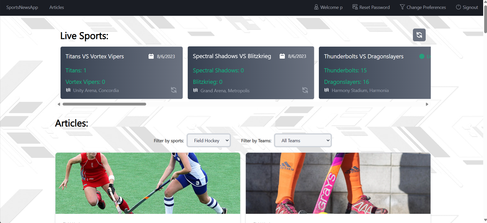
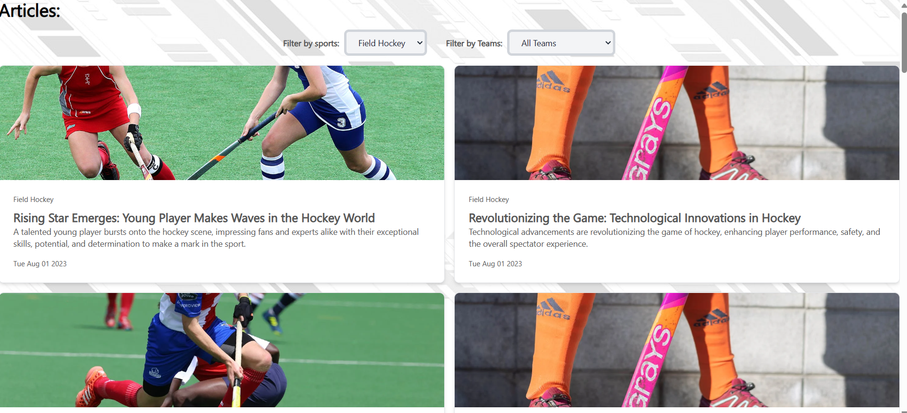

# React + Vite

This template provides a minimal setup to get React working in Vite with HMR and some ESLint rules.

Currently, two official plugins are available:

- [@vitejs/plugin-react](https://github.com/vitejs/vite-plugin-react/blob/main/packages/plugin-react/README.md) uses [Babel](https://babeljs.io/) for Fast Refresh
- [@vitejs/plugin-react-swc](https://github.com/vitejs/vite-plugin-react-swc) uses [SWC](https://swc.rs/) for Fast Refresh


# Sports Center Live 301

"Sports Center Live 301" is an innovative single page web application designed to cater to sports enthusiasts by providing them with real-time updates, articles, and match highlights. Built with cutting-edge web technologies like React and TypeScript, the app delivers an immersive sports experience while ensuring user convenience and security.

## Features

- **User Authentication**: Seamlessly sign up, sign in, and manage your account securely and swiftly.
- **Personalized Experience**: Tailor your news feed by selecting your favorite teams and sports in user preferences.
- **Comprehensive Content**: Access a wide range of sports content, including articles, match updates, and team details.
- **User Management**: View and update account details, including password changes for enhanced security.

## Screenshots


*Home Page*


*Articles Page*
*


*Article Details*

## Live App

Check out the live application [here](https://sportnews301.netlify.app/).

## Demo Video

Watch the demo video [here](not done).

## Installation

Clone the repository:

## Rum Command

npm run dev

```bash
git clone https://github.com/godlord-py/sportnewsapp
